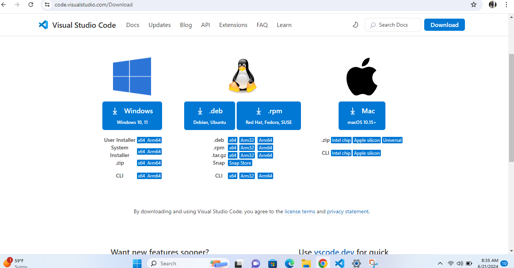

# Dev_Setup
Setup Development Environment

#Assignment: Setting Up Your Developer Environment

#Objective:
This assignment aims to familiarize you with the tools and configurations necessary to set up an efficient developer environment for software engineering projects. Completing this assignment will give you the skills required to set up a robust and productive workspace conducive to coding, debugging, version control, and collaboration.

#Tasks:

1. Select Your Operating System (OS):
   Choose an operating system that best suits your preferences and project requirements. Download and Install Windows 11. https://www.microsoft.com/software-download/windows11

2. Install a Text Editor or Integrated Development Environment (IDE):
   Select and install a text editor or IDE suitable for your programming languages and workflow. Download and Install Visual Studio Code. https://code.visualstudio.com/Download
   

   After visiting the official Visual Studio Code download page: https://code.visualstudio.com/Download.
   choose the appropriate version for my operating system (Windows)
    Run the downloaded .exe installer.
    Check the boxes for "Add to PATH" and "Register Code as an editor for supported file types" to make using VS Code more convenient.

    Open Visual Studio Code from your installed applications.
You can also open VS Code from the command line using code if you added it to your PATH during installation.
Click "Next" and then "Install".

Open the Extensions view by clicking on the Extensions icon in the Activity Bar on the side of the window or by pressing

3. Set Up Version Control System:
   Install Git and configure it on your local machine. Create a GitHub account for hosting your repositories. Initialize a Git repository for your project and make your first commit. https://github.com

   Visit the Git website: https://git-scm.com/downloads.
   Choose the appropriate version for Windows

Run the downloaded installer and follow the setup instructions.
During installation, you can keep the default settings.

4. Install Necessary Programming Languages and Runtimes:
  Instal Python from http://wwww.python.org programming language required for your project and install their respective compilers, interpreters, or runtimes. Ensure you have the necessary tools to build and execute your code.
  Visit the Python Website:

Open your web browser and go to Python's official website.

Navigate to the Downloads Section:

Click on the "Downloads" tab at the top of the page.
The website should automatically suggest the best version for the operating system in this case (windows)

Run the Installer:
Locate the downloaded file (usually in your Downloads folder) and run the installer.
  
When the installer opens, check the box that says "Add Python to PATH". This ensures that Python is added to your system's PATH, allowing you to run Python from any command prompt.
Click "Install Now".
Follow the prompts to complete the installation.

Verify Python Installation
Open a Command Prompt or Terminal:
 in Windows: Open Command Prompt. and run the command python --version to confirm the version

  Run  the following curl https://bootstrap.pypa.io/get-pip.py -o get-pip.py
5. Install Package Managers:
   If applicable, install package managers like pip (Python).
   Run the following command: pip --version to
    confirm the version of pip
   Download using this url if not already installed https://bootstrap.pypa.io/get-pip.py -o get-pip.py

   To get to the file directory wherw pip is installed run the following command:python get-pip.py

   install pip packages by running the following command pip install requests
6. Configure a Database (MySQL):
   Download and install MySQL database. https://dev.mysql.com/downloads/windows/installer/8.037.html
 
 Open your web browser and go to the MySQL downloads page: MySQL Installer for Windows.

 Select the setup type. The "Developer Default" option is usually sufficient, but you can choose "Server only" if you only need the MySQL server.

 The installer will check for any missing prerequisites and prompt you to install them

 Choose the MySQL products and features you want to install. Ensure that "MySQL Server" and "MySQL Workbench" are selected.

 Choose the installation path or keep the default.

 Click "Next" and then "Execute" to download and install the selected products.

 Choose "Standalone MySQL Server".

 Select the "Server Type" as "Development Machine".
Keep the "Port" as default (3306).
Click "Next".

Choose "Use Strong Password Encryption" for authentication.

Set a strong root password and confirm it.

Choose to run MySQL as a Windows Service.
Set the service to start automatically.

Once the configuration is applied, click "Finish".

MySQL Workbench will launch automatically. Use it to manage your databases.

Open MySQL Workbench from the Start menu.

Click on "Local instance MySQL" and enter the root password you set during the installation

Use the following SQL command to create a new database:CREATE DATABASE testdb;

Check the newly created database in the "Schemas" tab.

Click "Next" and then "Execute" to apply the configuration.

7. Set Up Development Environments and Virtualization (Optional):
   Consider using virtualization tools like Docker or virtual machines to isolate project dependencies and ensure consistent environments across different machines.

   Open a terminal or command prompt.
    Run the following command: pip install virtualenv

    Navigate to project directory by running the command:cd path/to/your/project

     Create a virtual environment: virtualenv venv

     Activate the virtual environment by running the following command: venv\Scripts\activate

   Create a requirements.txt file 

   Install the dependencies: pip install -r requirements.txt

   When you're done working in the virtual environment, you can deactivate it by simply typing: deactivate

8. Explore Extensions and Plugins:
   Explore available extensions, plugins, and add-ons for your chosen text editor or IDE to enhance functionality, such as syntax highlighting, linting, code formatting, and version control integration.

   in the installed VS code install the following extensions
   Python: Provides rich support for the Python language, including features such as IntelliSense, linting, debugging, and more.
   ext install ms-python.python

   ESLint: Integrates ESLint JavaScript into VS Code 
   ext install dbaeumer.vscode-eslint

Prettier - Code formatter: An opinionated code formatter
ext install esbenp.prettier-vscode

HTML CSS Support: Provides IntelliSense and CSS class name completion.
ext install ecmel.vscode-html-css

GitLens: Supercharges the built-in Git capabilities in VS Code
ext install eamodio.gitlens

GitHub Pull Requests and Issues: Integrates GitHub Pull Requests and Issues
ext install github.vscode-pull-request-github

Docker: Makes it easy to create, manage, and debug containerized applications.
ext install ms-azuretools.vscode-docker

SQLTools: SQL database management
ext install mtxr.sqltools

IntelliCode: AI-assisted development features
ext install VisualStudioExptTeam.vscodeintellicode

 Configure Extensions settings
 Go to File > Preferences > Settings (or press Ctrl+,).
Configure settings as needed for your installed extensions.

9. Document Your Setup:
    Create a comprehensive document outlining the steps you've taken to set up your developer environment. Include any configurations, customizations, or troubleshooting steps encountered during the process. 

    Comprehensive Developer Environment Setup Guide
Table of Contents
Introduction
Installing Necessary Programming Languages and Runtimes
Python Installation
Installing a Text Editor or Integrated Development Environment (IDE)
Visual Studio Code Installation
Setting Up Version Control System
Installing Git
Creating a GitHub Account
Initializing a Git Repository
Installing Package Managers
Configuring a Database (MySQL)
Setting Up Development Environments and Virtualization
Using Virtual Environment
Exploring Extensions and Plugins
Customizations and Troubleshooting
Conclusion
Introduction
This document outlines the steps taken to set up a comprehensive developer environment, including the installation of necessary programming languages, version control systems, text editors, database configurations, and various customizations and extensions to streamline the development workflow.

Installing Necessary Programming Languages and Runtimes
Python Installation
Download Python:

Go to the Python website.
Download the latest version of Python for your operating system.
Install Python:

Run the downloaded installer.
Ensure you check the option "Add Python to PATH" before proceeding with the installation.
Follow the installation prompts to complete the setup.
Verify Installation:

Open a command prompt or terminal.
Type python --version to verify the installation.
Installing a Text Editor or Integrated Development Environment (IDE)
Visual Studio Code Installation
Download Visual Studio Code:

Visit the Visual Studio Code website.
Download the appropriate installer for your operating system.
Install Visual Studio Code:

Run the downloaded installer and follow the installation prompts.
Verify Installation:

Open Visual Studio Code.
Ensure it opens without issues.
Setting Up Version Control System
Installing Git
Download Git:

Go to the Git website.
Download the Git installer for your operating system.
Install Git:

Run the downloaded installer.
Follow the installation prompts, using the default settings.
Verify Installation:

Open a command prompt or terminal.
Type git --version to verify the installation.
Creating a GitHub Account
Sign Up for GitHub:
Visit the GitHub website.
Click on "Sign up" and follow the prompts to create a new account.
Initializing a Git Repository
Create a Local Repository:

Open a command prompt or terminal.
Navigate to your project directory.
Run git init to initialize a new Git repository.
Make Your First Commit:

Run git add . to stage your changes.
Run git commit -m "Initial commit" to commit your changes.
Push to GitHub:

Create a new repository on GitHub.
Follow the instructions to push your local repository to GitHub.
Installing Package Managers
Install pip (Python):
pip is included by default with Python installations.
Verify by running pip --version in a command prompt or terminal.
Configuring a Database (MySQL)
Download MySQL:

Visit the MySQL website.
Download the MySQL installer for your operating system.
Install MySQL:

Run the downloaded installer.
Follow the installation prompts, setting up your root password and default configurations.
Verify Installation:

Open a command prompt or terminal.
Type mysql --version to verify the installation.
Setting Up Development Environments and Virtualization
Using Virtual Environment
Install virtualenv:

Run pip install virtualenv in a command prompt or terminal.
Create a Virtual Environment:

Navigate to your project directory.
Run virtualenv venv to create a virtual environment.
Activate the Virtual Environment:

On Windows: .\venv\Scripts\activate
On macOS/Linux: source venv/bin/activate
Deactivate the Virtual Environment:

Run deactivate in the command prompt or terminal.
Exploring Extensions and Plugins
Essential Extensions for Visual Studio Code
Open the Extensions Marketplace:

Click on the Extensions icon in the Activity Bar or press Ctrl+Shift+X.
Install Extensions:

Python: ext install ms-python.python
ESLint: ext install dbaeumer.vscode-eslint
Prettier - Code formatter: ext install esbenp.prettier-vscode
Docker: ext install ms-azuretools.vscode-docker
GitLens: ext install eamodio.gitlens
Configure Extensions:

Go to File > Preferences > Settings (or press Ctrl+,).
Customize settings as needed for your extensions.
Customizations and Troubleshooting
Customizing VS Code:

Configure settings for themes, font sizes, and keybindings.
Install additional extensions as needed.
Troubleshooting Common Issues:

Python Not Found: Ensure Python is added to your PATH during installation.
Git Issues: Verify Git installation and configuration by checking the version and global user settings.
Extension Problems: Check for extension updates and review settings.

#Deliverables:
- Document detailing the setup process with step-by-step instructions and screenshots where necessary.
- A GitHub repository containing a sample project initialized with Git and any necessary configuration files (e.g., .gitignore).
- A reflection on the challenges faced during setup and strategies employed to overcome them.

#Submission:
Submit your document and GitHub repository link through the designated platform or email to the instructor by the specified deadline.

#Evaluation Criteria:**
- Completeness and accuracy of setup documentation.
- Effectiveness of version control implementation.
- Appropriateness of tools selected for the project requirements.
- Clarity of reflection on challenges and solutions encountered.
- Adherence to submission guidelines and deadlines.

Note: Feel free to reach out for clarification or assistance with any aspect of the assignment.

Kindly find attached the screenshots on this google.doc link:https://docs.google.com/document/d/12jhmHQwT_v22Lt9bBZNduZTsQGDeauZq/edit#heading=h.gjdgxs